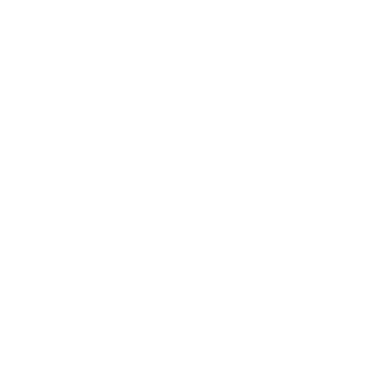
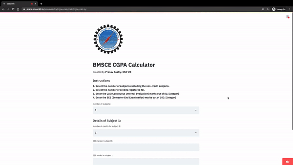

# cgpa-calc

 

A Streamlit app designed to calculate CGPA based on the college results. 
 
This version is specifically designed for BMSCE. Other colleges can fork this repo to customize this according to the marking scheme.  

**Instructions** 
**1. If you want to assign names for the subjects, select the checkbox in the Utilities and enter the details. Else, continue. 2. Select the number of subjects excluding the non-credit subjects. 3. Select the number of credits registered for. 4. Enter the CIE (Continuous Internal Evaluation) marks out of 50. [Integer] 5. Enter the SEE (Semester End Examination) marks out of 100. [Integer]**
